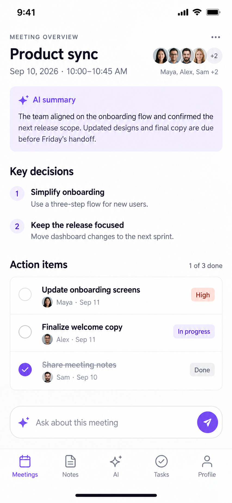

# AI Meeting Home Screen

A high-fidelity AI meeting companion interface designed to help users review meetings, understand key decisions, track action items, and ask AI questions about previous discussions.

## Video Walkthrough

[](https://www.youtube.com/watch?v=-6aoRUWaqMc)

▶️ [Watch the full workflow on YouTube](https://www.youtube.com/watch?v=-6aoRUWaqMc)

## UI Preview



## Overview

The AI Meeting Home Screen explores how artificial intelligence can simplify the post-meeting experience.

Instead of requiring users to review an entire transcript, the interface organizes the most important information into clear and accessible sections, including meeting summaries, key decisions, action items, and AI-powered follow-up questions.

The project focuses on creating an AI experience that remains simple, useful, and easy to scan.

## Main Features

- AI-generated meeting summary
- Key decisions extracted from the discussion
- Action items with assignees and due dates
- Task priority and completion status
- Participant information
- AI-powered questions about previous discussions
- Clean and compact mobile interface

## Design Approach

The interface was designed around a simple principle: users should be able to understand what happened in a meeting within a few seconds.

The layout prioritizes information according to importance and reduces unnecessary visual elements.

The experience is structured around four main needs:

- Understand what happened
- Identify important decisions
- Know what needs to be done next
- Ask AI for additional context

## Design Specification

The complete design specification for this project is available in:

[View DESIGN.md](DESIGN.md)

The `DESIGN.md` file documents the visual language, layout, spacing, typography, components, interaction patterns, and other design decisions used in the interface.

Its structure was developed using the Google Labs Code `DESIGN.md` format as a reference:

[Google Labs Code — DESIGN.md Format Specification](https://github.com/google-labs-code/design.md/blob/main/docs/spec.md)

## Prototype

The prototype is available inside the `docs` folder:

```text
docs/
├── index.html
├── styles.css
└── app.js
```

The prototype is built using HTML, CSS, and JavaScript.

## Project Structure

```text
ai-meeting-home-screen/
├── README.md
├── DESIGN.md
├── preview.png
└── docs/
    ├── index.html
    ├── styles.css
    └── app.js
```

## Workflow

The project explores an AI-assisted product design workflow, moving from interface requirements and design specifications to a functional prototype.

The process combines AI-assisted design exploration with implementation through Codex.

## Purpose

This project was created as an exploration of AI-native UX/UI design and how meeting applications can transform complex conversation data into clear, actionable information.

## Status

Prototype completed.
